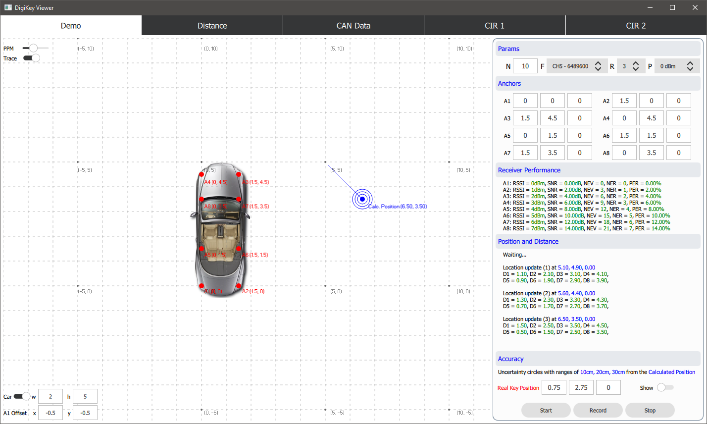

# PyDigiKey
This project visualizes the data from DigiKey in Qt-based UI

### Hardware
NPX UWB (Ultra Wideband) Remote Control  
CAN-USB interface

### Software
Python 3  
Qt QML (via PySide2 (Qt for Python))

### Preview

## License
This project comes with a GNU LGPL v3 license.  
